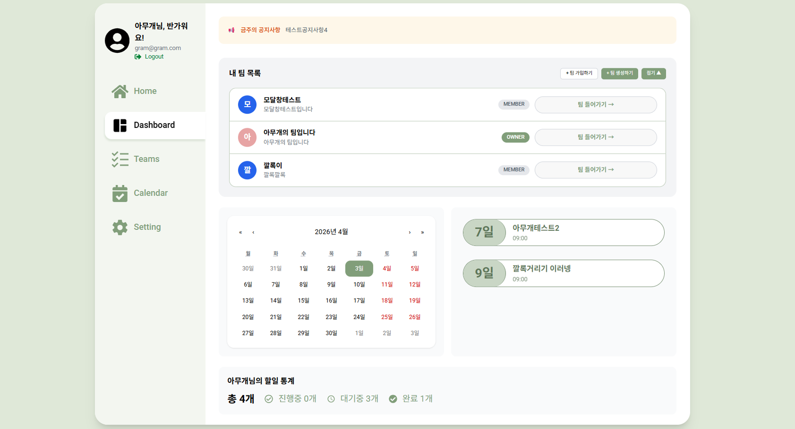
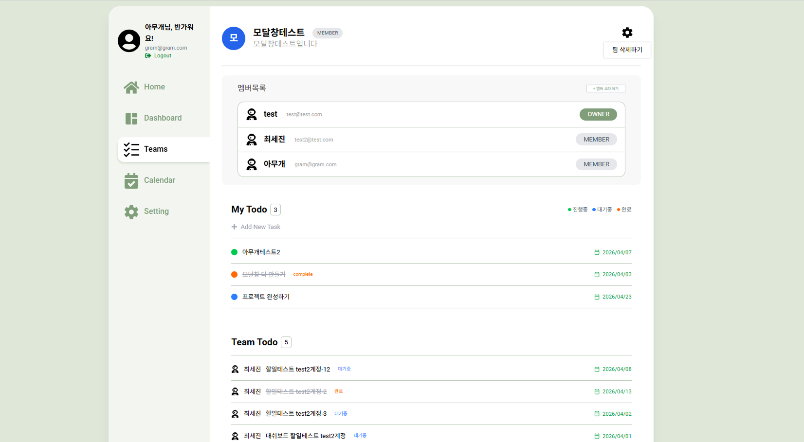
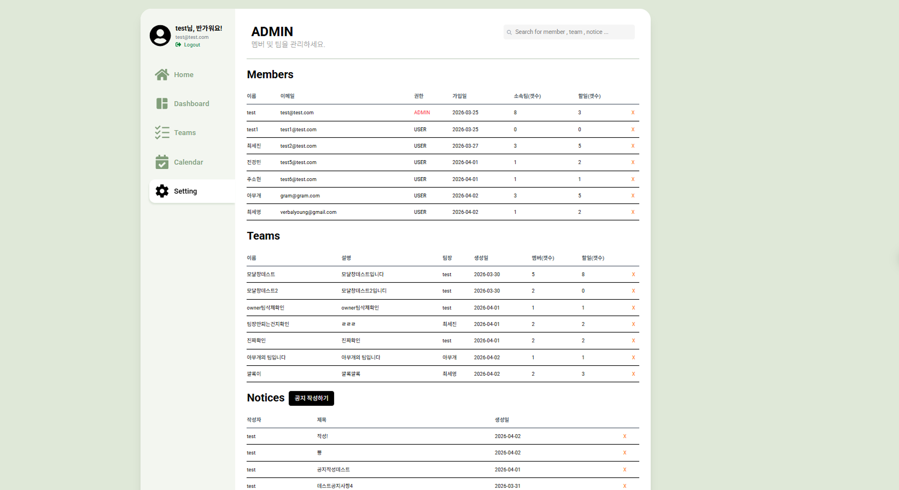

# 📌 TeamFlow – 협업 관리 웹 서비스

> 실제 팀 프로젝트 환경을 가정하여  
> 팀 / 할 일 / 멤버를 통합 관리하는 협업 플랫폼

---

## 🔗 프로젝트 링크
- GitHub: https://github.com/choisejin12/TeamFlow  
- 배포: https://team-flow-three.vercel.app/

---

## 📖 프로젝트 개요

TeamFlow는 팀 단위 협업 환경을 웹으로 구현한 서비스입니다.  
사용자는 팀을 생성하고, 초대코드를 통해 멤버를 초대하며, 할 일(Task)을 생성·관리하고, 역할 기반으로 협업을 진행할 수 있습니다.

단순 CRUD를 넘어 <b>권한 기반 협업 구조 + 인증 + 상태 관리 구조 설계</b>에 초점을 둔 프로젝트입니다.

---

## 🎯 프로젝트 목적

- JWT 기반 인증 및 권한 관리 구조 이해
- React Query를 활용한 서버 상태 관리 및 캐싱 전략 적용
- Redux를 활용한 사용자 상태 전역 관리 구조 설계
- 서버 상태와 클라이언트 상태를 분리하여 효율적인 데이터 흐름 구현
- 실사용 가능한 협업 서비스 아키텍처 설계 경험
- Full Stack 개발 경험 및 서비스 단위 프로젝트 완성

---

## 🛠 기술 스택

### Frontend
- React (Vite)
- TypeScript
- React Query
- Redux Toolkit
- Tailwind CSS

### Backend
- Node.js + Express
- MongoDB (Mongoose)
- JWT 인증

---

## ⚙️ 주요 기능 (MVP)

- 회원가입 / 로그인
- 팀 생성 및 팀 목록 조회
- 초대코드를 통한 팀 가입
- 팀 멤버 관리
- 할일(Task) CRUD
- 공지사항 CRUD
- 통계 기능

---

## 👥 사용자 권한 구조

### 1. 플랫폼 관리자 (ADMIN)
- 전체 팀 조회 및 삭제
- 유저 관리
- 공지 작성

### 2. 팀장 (OWNER)
- 초대코드 생성
- 팀 내부 관리 ( 삭제 )

### 3. 멤버 (USER)
- 본인 Task 생성/수정/삭제
- 팀 참여

---

## 🧠 핵심 설계

### 1. 팀-유저 관계 분리 구조
User ←→ Team (직접 연결 X)
 ↓
TeamMember (중간 컬렉션)
- 한 유저가 여러 팀 참여 가능
- 팀별 역할 관리 가능
- 확장성 높은 구조

---

### 2. 권한 기반 접근 제어
JWT 인증 → 사용자 식별 → role 체크 → API 접근 제한
- auth middleware에서 토큰 검증
- req.user 기반 권한 처리

---

### 3. 초대코드 시스템
팀장 → 코드 생성 → 유저 입력 → 팀 가입
- code unique
- 만료시간 1시간

---

### 4. 상태 관리 구조

| 영역 | 사용 기술 |
|------|----------|
| 서버 상태 | React Query |
| 사용자 상태 | Redux |

👉 서버 상태와 클라이언트 상태를 분리하여 관리

---

## 🔄 주요 로직 흐름

### 로그인
사용자 입력 → /users/login → JWT 발급 → localStorage 저장 → Redux 저장

---

### 팀 생성
POST /teams → DB 저장 → invalidateQueries → UI 자동 반영

---

### 할 일 생성
Task 생성 → DB 저장 → invalidateQueries(['teamDetail']) → 자동 리렌더링

---

### 팀 가입
초대코드 입력 → /invite/join → TeamMember 생성 → 팀 연결

---

## 📄 페이지 구조
| 페이지            | 설명      |
| -------------- | ------- |
| /login         | 로그인     |
| /signup        | 회원가입    |
| /dashboard     | 팀 목록    |
| /join          | 초대코드 가입 |
| /teams/:teamId | 팀 상세    |
| /admin         | 관리자 페이지 |


### 📸 Preview

#### 🏠 Dashboard (팀 목록 및 통계)
- 사용자가 속한 팀 목록 조회
- 개인 Task 통계 확인



---

#### 👥 Team Page (팀 상세)
- 팀 멤버 확인
- 초대코드 생성
- 팀 내 Task 관리



---

#### 📋 Calendar Management
- Task의 마감일(dueDate)을 캘린더 형태로 시각화
- 전체 Task 일정을 한눈에 확인 가능


---

#### 🔐 Admin Page
- 전체 팀 관리
- 공지사항 관리



---

## 🚀 Key Implementation

### 1. 🔥 React Query 기반 데이터 동기화

```ts
queryClient.invalidateQueries(['teamDetail'])
```
👉 API 재호출 없이 자동 UI 업데이트
### 2. 🔐 JWT 인증 구조
```ts
Authorization: Bearer <token>
````
👉
middleware에서 사용자 검증
req.user 기반 권한 처리

### 3. 🧩 관계형 데이터 설계
```ts
{ teamId: 1, userId: 1 } // unique index
```
👉 중복 가입 방지 + 성능 최적화

### 4. 🚧 라우팅 보호 구조
```ts
ProtectedRoute
NotAuthRoute
AdminRoute
```
👉 페이지 단위 접근 제어

---


## 🗄 데이터베이스 구조

### 주요 컬렉션

- users
- teams
- teamMembers
- tasks
- invites
- notices

---

---

## 💡 Troubleshooting

### ❌ JWT 인증 오류
원인: Authorization Header 형식 오류
해결: Bearer 토큰 형식 통일

### ❌ 팀 삭제 시 500 에러
원인: TeamMember 데이터 미삭제
해결 
```ts 
await TeamMember.deleteMany({ teamId });
```
### ❌ 상태 동기화 문제
해결: React Query invalidateQueries 활용


